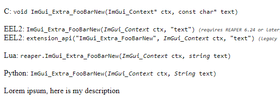

# ReaImGui Extra Template

- [ReaImGui Extra Template](#reaimgui-extra-template)
  - [Intro](#intro)
  - [Architecture](#architecture)
  - [Installation/Building](#installationbuilding)
  - [Acknowledgements](#acknowledgements)

## Intro

This template shows how to implement an addon for ReaImGui which can use existing C++ ImGui widgets.
Or in the event you'd like to write a ReaImGui widget using functionality from C++ that you can't access from ReaScript (either via third-party C++ libraries, or through the natuve REAPER C++ SDK for example).

## Architecture

- The project has a single external dependency (ImGui)
  - The version of ImGui **MUST** match the version which a user's ReaImGui was compiled with.
- There is a `vendor` directory which links:
  - `reaper-sdk`
  - ReaImGui's generated exported-functions header (`reaper_imgui_functions.h`)
  - ReaImGui's ReaScript argument utility header (`api_vararg.hpp`)
- The `/src` directory contains the user code:

  - `api.(cpp|hpp)` is a wrapper for registering definitions with REAPER, written by `cfillion`
  - `main.cpp` exposes the required `REAPER_PLUGIN_ENTRYPOINT`, in it every instance of an `API` class has it's definition registered with REAPER
  - `utils.(cpp|hpp)` contains some utility structs/methods for working with the ImGui context, and for defining new ReaScript/ReaImGui methods (`DEFINE_API()` macro)
  - The `src/widgets` directory is meant to contain implementations of ImGui widgets and their ReaScript definitions to register.

    - You can find an example at `src/widgets/my-widget.cpp`
    - ```cpp
      #include "../utils.hpp"
      #include <imgui.h>

      void FooBarNew(ImGui_Context* ctx, const char* text)
      {
          // Always call this, it sets the ImGui context and checks other things
          if (!FRAME_GUARD(ctx))
          {
              return;
          };
          ImGui::Text("%s", text);
      }

      DEFINE_API(FooBarNew)
      ("void", {{"ImGui_Context*", "ctx"}, {"const char*", "text"}}, "Lorem ipsum, here is my description");
      ```

    - 

## Installation/Building

The project should theoretically be able to be compiled regardless of whether you have the required external dependencies, in a handful of commands.

The Lua-based build tool `xmake` was used here, for ease-of-use: https://github.com/xmake-io/xmake

It will fetch third-party dependencies automatically and is a build system on it's own, but is capable of generating `CMakeLists.txt`, `.vsxproj`, XCode projects, `compile_commands.json`, etc.

The `CMakeLists.txt` and `compile_commands.json` are uploaded here, but they are not portable -- XMake generates absolute paths to your includes. You will need to follow the instructions at the bottom to generate your own copies of this with proper include paths if you wish to have them available.

> (_Alternatively, if you don't wish to use xmake, you can alter these absolute paths or use another build system entirely._)

You can find the xmake build file at `./xmake.lua`

To build the project:

- Recursively clone the repo (to include submodule in `./vendor`): `$ git clone --recursive https://github.com/GavinRay97/reaimgui-extra-template.git`
- Install xmake:
  - On unix systems, or Git Bash/MinGW: `bash <(curl -fsSL https://xmake.io/shget.text)`
  - On Windows: `Invoke-Expression (Invoke-Webrequest 'https://xmake.io/psget.text' -UseBasicParsing).Content`
- Generate a build config (substitute your platform for `windows` if not `windows`):
  - `$ xmake config --plat=windows --mode=debug --arch=x64 --verbose --diagnosis --clean`
- Run the build:
  - `$ xmake build --verbose --diagnosis`
  - **Note:** This will install and configure includes for any missing packages (in this case `imgui 1.82`) automatically
- (Optional) Generate `CMakeLists.txt` and `compile_commands.json`:
  - `$ xmake generate_cmakelists_and_compile_commands`

**You should now find the dynamic library inside of `./build/$PLATFORM/x64/debug`**

```lua
-- Requires will try to use either system package manager, or third-party package manages (vcpkg, Conan, etc)
-- To automatically find and wire up library dependencies. It will fall back to git .tar.gz releases if none found.
add_requires("imgui v1.82", { verify = false })
add_rules("mode.debug", "mode.release")

-- 1. Set the current config: $ xmake config --plat=windows --mode=debug --arch=x64 --verbose --diagnosis --clean
-- 2. Then run the build:     $ xmake build --verbose --diagnosis
-- 3. Generate CMake/Comp DB: $ xmake generate_cmakelists_and_compile_commands
target("reaper_imgui_extra_myaddon_x64")
  set_arch("x64")
  set_kind("shared")
  set_plat(os.host())
  set_optimize("fastest") -- none, faster, fastest, smallest
  set_languages("c99", "cxx17")
  add_files("src/*.cpp")
  add_files("src/widgets/*.cpp")
  add_includedirs("./vendor")
  add_includedirs("./vendor/reaper-sdk/sdk")
  add_packages("imgui")
```

## Acknowledgements

My sincerest thanks go to @cfillion for holding my hand during most of this process and not losing patience with me =)
